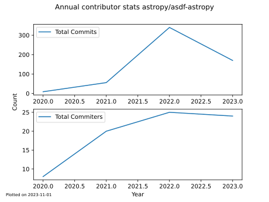
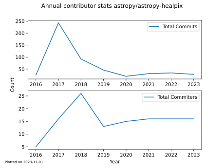
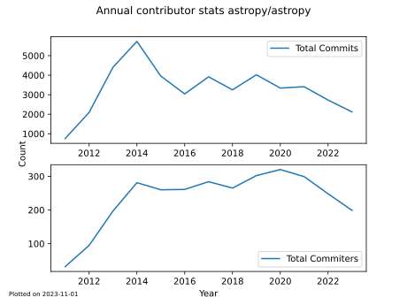
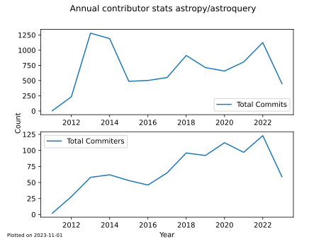
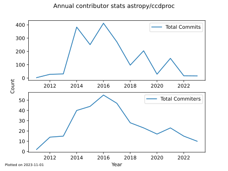
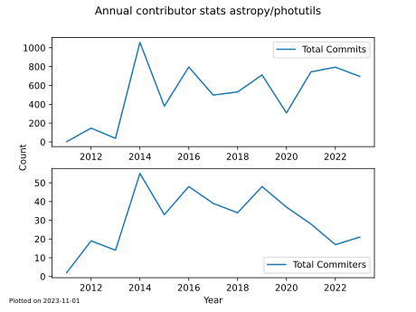
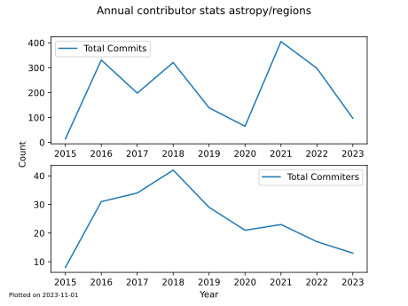
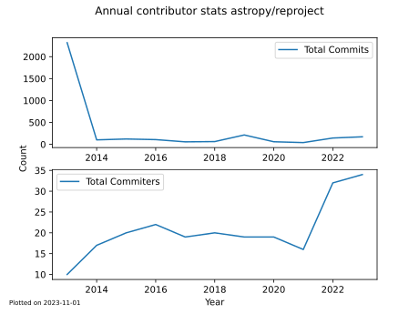
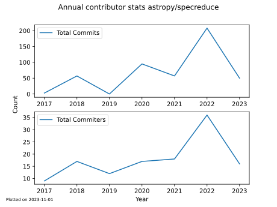
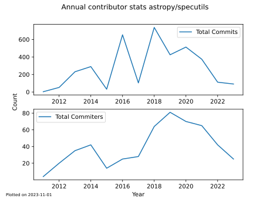

# Annual Commiters and Commits for Core Astropy projects

Summary plots of commiters and commits for core packages in the astropy community. 

**Note that when the current year is incomplte, you should interpret numbers as incomplte for the current year**

---

 

[📄PDF](astropy_asdf-astropy_monthly_commits.pdf)

---

[📄PDF](astropy_astropy-healpix_monthly_commits.pdf)

---

[📄PDF](astropy_astropy_monthly_commits.pdf)

---

[📄PDF](astropy_astroquery_monthly_commits.pdf)

---

[📄PDF](astropy_ccdproc_monthly_commits.pdf)

---

[📄PDF](astropy_photutils_monthly_commits.pdf)

---

[📄PDF](astropy_regions_monthly_commits.pdf)

---

[📄PDF](astropy_reproject_monthly_commits.pdf)

---

[📄PDF](astropy_specreduce_monthly_commits.pdf)

---

[📄PDF](astropy_specutils_monthly_commits.pdf)